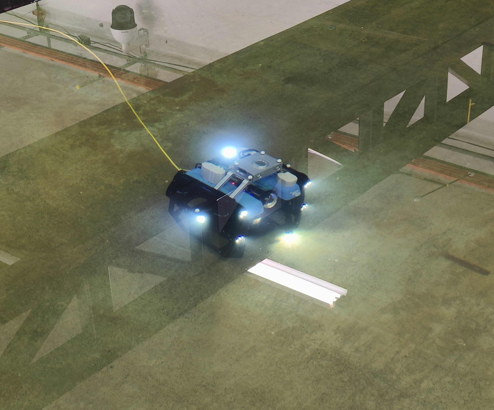
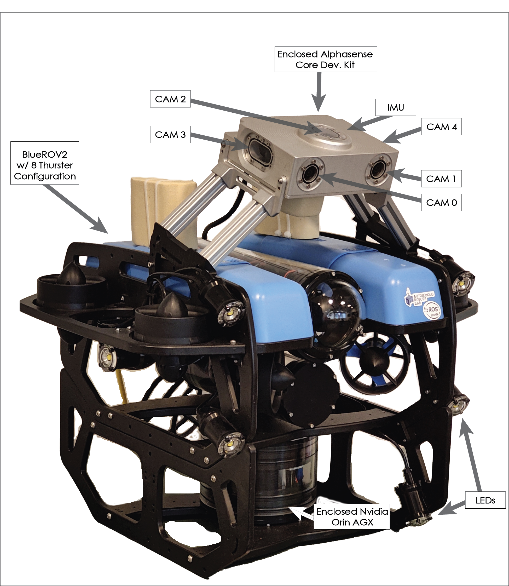

# Multi Camera Underwater Visual Inertial Dataset

[](https://opensource.org/licenses/BSD-3-Clause)

## About
This is an underwater dataset
consisting of multiple onboard sensors, mainly, 5 Camera and IMU ( [Alphasense Core Research Developent Kit](https://github.com/sevensense-robotics/core_research_manual)),a Pressure Sensor, and actuator commands from an ROV piloted in an indoor facility ([MC-lab](https://www.ntnu.edu/imt/lab/cybernetics)). A total of 24 trajectories are collected with following characteristics:
* `4 Motion patterns with length 100-120m`
* `External illumination ranging from 100 to 700 lux`
* `Onboard illumination at 3 gradual levels`

Additionally, we provide trajectories with varying media (Air, Water).

## Updates / News
* **Apr  7 2024:** Added 6 trajectrories (2 lighing conditions x 3 motion patterns) with peicewise-continuous ground-truth from motion capture. Link: [Subset 3](https://github.com/ntnu-arl/underwater-datasets/edit/main/README.md#subset-3-trajectories-with-ground-truth-from-motion-capture)
* **Nov 29 2023:** Uploaded undertwater dataset with multi-camera imu system for underwater VIO and camera models. Link: [Subset 1](https://github.com/ntnu-arl/underwater-datasets/tree/main?tab=readme-ov-file#subset-1-motion-patterns) and [Subset 2](https://github.com/ntnu-arl/underwater-datasets/tree/main?tab=readme-ov-file#subset-2-trajectories-with-varying-media-air-water)


### Varying illumination at 6 levels
| |  |  | |  | |
:-------------------------:|:-------------------------:|:-------------------------:|:-------------------------:|:-------------------------:|:-------------------------:
  |   |   |   |   |  

### 5 Camera and IMU
Cam0 | Cam1 | Cam2 | Cam3 | Cam4
:-------------------------:|:-------------------------:|:-------------------------:|:-------------------------:|:-------------------------:
  |   |   |   |   

<!-- 
This is an underwater dataset collected using an custom BlueROV (Retrofit Heavy Configuration). -->

### Ariel: Underwater robot with multi-camera imu and compute suite
Robot in water | System Description 
:-------------------------:|:-------------------------:
  |   

### Motion Patterns
| Shape | Distance Travelled (m) | Mean Linear Velocity (m/s) | Mean Angular Velocity (rad/s) |
| --- | --- | --- | --- |
| Rectangular | 120 | 0.25 | 0.12|
| Infinity | 108 | 0.45 | 0.16|
| Dumb-bell | 110 | 0.45 | 0.20|
| Dumb-bell w/ Transverse Motion | 110 | 0.25 | 0.11|


## Trajectories with Visual Inetrial Data
### Subset 1: Motion Patterns
The first subset contains 24 trajectories with 4 motion patterns and varying illumination.

Each of the trajectory contains following data in ROS bag format:

1) Camera | fps: 20Hz | resolution: 540p*720p | format: Mono8 | Topics:
```
/alphasense_driver_ros/cam0  # Front Stereo Pair: Right
/alphasense_driver_ros/cam1  # Front Stereo Pair: Left
/alphasense_driver_ros/cam2  # Top Camera
/alphasense_driver_ros/cam3  # Right Side Camera
/alphasense_driver_ros/cam4  # Left Side Camera
```
2) IMU (synced with cameras) | fps: 200Hz | Topics:
```
/alphasense_driver_ros/imu
```
3) IMU on FCU (Pixhawk) | fps: 50Hz | Topics:
```
/mavros/imu/data
```
4) Pressure Sensor | fps: 50Hz | Topics:
```
/mavros/imu/static_pressure
```
5) Actuator output PWM | fps: 50Hz | Topics:
```
/mavros/rc/out # ch 1-8 thrusters, ch 9-10 for Lumen LED
```

The collective data can be found [(1-18)](https://ntnu.box.com/s/xgsepbu96ty8ylzcz7sjyg6vvo3hciwe) and [(19-24)](https://ntnu.box.com/s/nrelktzxg6a2pa5p3kp0nnuyd0rpkicj), whereas the following table contains link to each trajectory:

### Motion Pattern 1 (Rectangular)
| Shape | Distance Travelled (m) | Mean Linear Velocity (m/s) | Mean Angular Velocity (rad/s) |
| --- | --- | --- | --- |
| Rectangular | 120 | 0.25 | 0.12|
___________

| No. | Illumination | Duration (s) | Size (Gb) | Link |
| --- | --- | --- | --- | --- |
| 1 | E0+O1 | 460  | 18.1| [link](https://ntnu.box.com/s/nnktnmgshz3e1v6whs6iabfpfubh1j0r)
| 2 | E0+O2 | 456 | 17.8| [link](https://ntnu.box.com/s/150bajeprv0f8jvtk3zwaia3wskpf0u8)
| 3 | E0+O3 | 392 | 15.3| [link](https://ntnu.box.com/s/yldexh6sw50z8oqigy8hrll43kwx754k)
| 4 | E1+O3 | 386 | 15.1| [link](https://ntnu.box.com/s/k7cf5wm2xudpeaecr9xyf6ii40l70dzq)
| 5 | E1+O2 | 443 | 17.3| [link](https://ntnu.box.com/s/7a05kvmw95l0124tsl8zf98egj4wclxc)
| 6 | E1+O1 | 395 | 15.4 | [link](https://ntnu.box.com/s/ru33adfwicobv0ugnpn4byigdfbjho55)

### Motion Pattern 2 (Infinity)
| Shape | Distance Travelled (m) | Mean Linear Velocity (m/s) | Mean Angular Velocity (rad/s) |
| --- | --- | --- | --- |
| Infinity | 108 | 0.45 | 0.16|
_____________

| No. | Illumination | Duration (s) | Size (Gb) | Link | 
| --- | --- | --- | --- | --- |
| 7 | E1+O1 | 251  | 9.8| [link](https://ntnu.box.com/s/2me1s6o4uqzfz3ai804t4sbwvmnzye91)
| 8 | E1+O2 | 252 | 9.8| [link](https://ntnu.box.com/s/2njbkv6mgqzlrxw2vr1k9qkedggd5sdh)
| 9 | E1+O3 | 262 | 10.2| [link](https://ntnu.box.com/s/3vofmpx83jn10jby7om44reapjbculme)
| 10 | E0+O3 | 281 | 11.0| [link](https://ntnu.box.com/s/ow0yjer634yb6y2vibi0f6im6lr3hb2b)
| 11 | E0+O2 | 279 | 10.9| [link](https://ntnu.box.com/s/2nu1q2t6i402j0vt6r9p1280071w0rtb)
| 12 | E0+O1 | 263 | 10.2 | [link](https://ntnu.box.com/s/ybxfvueawqagv20huehqj08gtpxsprwk)

### Motion Pattern 2 (Dumbbell)
| Shape | Distance Travelled (m) | Mean Linear Velocity (m/s) | Mean Angular Velocity (rad/s) |
| --- | --- | --- | --- |
|  Dumb-bell | 110 | 0.45 | 0.20|
_____________

| No. | Illumination | Duration (s) | Size (Gb) | Link | 
| --- | --- | --- | --- | --- |
| 13 | E0+O1| 251 |  9.8| [link](https://ntnu.box.com/s/ho8sz412taqe94ehhbmw1icgamh3anu1)
| 14 | E0+O2| 252 |  9.8| [link](https://ntnu.box.com/s/jbxqb5d9ao9trlsuixciaoer48g8mddh)
| 15 | E0+O3| 262 | 10.2| [link](https://ntnu.box.com/s/hs9che0xplz1zaqk9vt2xxzi4ux070mz)
| 16 | E1+O3| 281 | 11.0| [link](https://ntnu.box.com/s/w5948mujkpxq32k3oly5ktuh5oa393up)
| 17 | E1+O2| 279 | 10.9| [link](https://ntnu.box.com/s/txkgl98rngbm3twv2ifl8lm0ogzoc7mo)
| 18 | E1+O1| 263 | 10.2| [link](https://ntnu.box.com/s/ksrjxwbn3iadx0secif8ywgbyphud9a1)

### Motion Pattern 2 (Dumbbell w/ Transverse Motion)
| Shape | Distance Travelled (m) | Mean Linear Velocity (m/s) | Mean Angular Velocity (rad/s) |
| --- | --- | --- | --- |
| Dumbbell w/ Transverse Motion | 110 | 0.25 | 0.11|
_____________

| No. | Illumination | Duration (s) | Size (Gb) | Link | 
| --- | --- | --- | --- | --- |
| 19 | E1+O1| 251 |  9.8| [link](https://ntnu.box.com/s/1qzl70sitoihlmy2f1lold7by4t3wyp1)
| 20 | E1+O2| 252 |  9.8| [link](https://ntnu.box.com/s/msywm8yd8pm52xsy5ho6j7e8dweuonzo)
| 21 | E1+O3| 262 | 10.2| [link](https://ntnu.box.com/s/7jvmazzutn7t319q4b1kd99oosts41h2)
| 22 | E0+O3| 281 | 11.0| [link](https://ntnu.box.com/s/md92htqqe9qvpio5280u6tuqsritar80)
| 23 | E0+O2| 279 | 10.9| [link](https://ntnu.box.com/s/cyeh04s1zgwpvkywfsy9nmkv6hx3u245)
| 24 | E0+O1| 263 | 10.2| [link](https://ntnu.box.com/s/swl2wplywlkrjjy6xm57o2uhfmsnmgry)

**Illumination Details:** External light has two levels E0 corresponding to 100 - 300 lux and E1 corresponding to 400-700 lux measured outside and above water surface. Onboard light varies between three incremental levels, O1, O2, and O3, corresponinding to 20%, 40%, 60% pwm level of the [Lumen Subsea LED](https://bluerobotics.com/store/thrusters/lights/lumen-r2-rp/) (Max: 1500 lumens) respectively.

### Subset 2: Trajectories with Varying Media (Air, Water)
The second subset contains 6 trajectories with varying media (Air, Water).

<p align="center">
  
</p>

| Trajectory | Duration | Size | Link | 
| --- | --- | --- | --- |
| 1 |  173  | 2.6| [link](https://ntnu.box.com/s/iwx42iv4hunvc74zy2s3du6g7nhe1ja4)
| 2 |  126 | 1.9| [link](https://ntnu.box.com/s/57c4pxgxms20ok4l6hvoxbrvfdlj26h1)

## Camera IMU Calibration 

The cameras were calibrated using the [Kalibr](https://github.com/ethz-asl/kalibr) toolbox. The calibration data  is provided in the following table with the links for each camera intrinsics and extrinsics.

| Camera | Intrinsics (Air) | Intrinsics (Water) | Extrinsics | 
| --- | --- | --- | --- |
| cam0, cam1(Stereo Pair)| [link](https://ntnu.box.com/s/rwzq02hu1bfqxfy42bub543bxqyrq4sm) | [link](https://ntnu.box.com/s/2a8avom1h12wuzqbhonigqqa7rbe0g73) | [link](https://ntnu.box.com/s/whcuhsbetjoxgwsh4hw5lx14gqdnd7bl)
| cam3| [link](https://ntnu.box.com/s/fudzuacwy6tzeh94n2qvxi69w6ld62f3) | [link](https://ntnu.box.com/s/hih3fnhvsdkyhce90im1cfpwllb4vxj3) | [link](https://ntnu.box.com/s/ykilwh0q4qtgaolkctlob6klaqgx0ges)
| cam4| [link](https://ntnu.box.com/s/mrqh25cw3acr7xgmnrgzdqwt5lekcw1t) | [link](https://ntnu.box.com/s/hjrcxpa7plnhh8mp0zx28ff5bxn191hj) | [link](https://ntnu.box.com/s/xpqmeamdc0ivbm0ano6ywz0vv1uqfgzy)

### Subset 3: Trajectories with Ground-truth from Motion Capture
 


| No. | Illumination | Duration (s) | Size (Gb) | Motion Pattern | Link | 
| --- | --- | --- | --- | --- | --- |
| 1 | E1+O1| 370 |  14.5| Rectangular | [link](https://ntnu.box.com/s/8tpgvtqlrhol8rts929x9h3rbo57mat6)
| 2 | E1+O1| 374 |  14.7| Infinity/Figure "8" | [link](https://ntnu.box.com/s/8fx6gyah6yfg4k7hj59yl2gwk712qq0q)
| 3 | E1+O1| 318 | 12.5| Dumbbell | [link](https://ntnu.box.com/s/qdcuxce9oxze85peipo89a2rz1wwuh03)
| 4 | E0+O1| 405 | 15.9| Rectangular | [link](https://ntnu.box.com/s/szyn2w0dp4qnil6p0k1o4h3f4o7zt3vx)
| 5 | E0+O1| 401 | 15.7| Infinity/Figure "8" | [link](https://ntnu.box.com/s/uv37rnewohgzv724i495zphcrmdjr4j0)
| 6 | E0+O1| 302 | 11.6| Dumbbell | [link](https://ntnu.box.com/s/ya0v9f6zzfbs84v976d8v5ruq0lcrbf5)

## Reference
If you use this work in your research, please cite the publications as follows:

[An Online Self-calibrating Refractive Camera Model with Application to Underwater Odometry](https://arxiv.org/abs/2310.16658)
```
@misc{singh2023online,
      title={An Online Self-calibrating Refractive Camera Model with Application to Underwater Odometry}, 
      author={Mohit Singh and Mihir Dharmadhikari and Kostas Alexis},
      year={2023},
      eprint={2310.16658},
      archivePrefix={arXiv},
      primaryClass={cs.RO}
}
```

## Contact
You can contact us for any question:
* [Mohit Singh](mailto:mohit.singh@ntnu.no)
* [Mihir Dharmadhikari](mailto:mihir.dharmadhikari@ntnu.no)
* [Kostas Alexis](mailto:konstantinos.alexis@ntnu.no)
